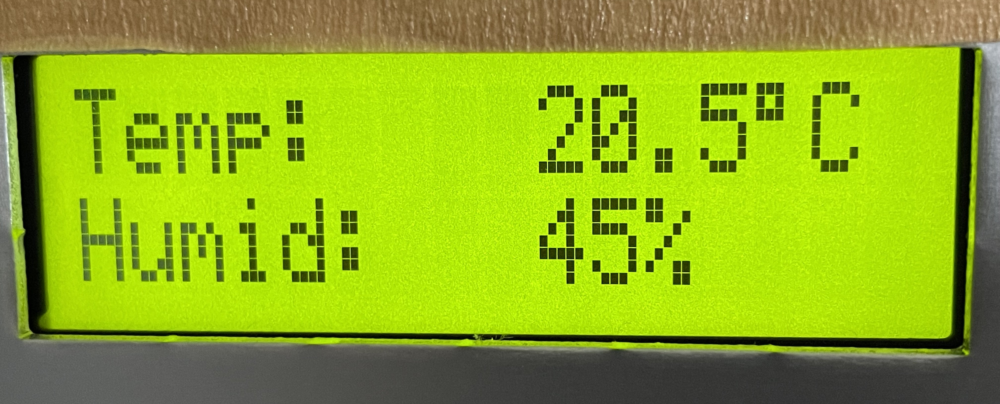

# AVRIOlibraryEIS2020
Repo for IHK Abschlussprüfung Teil 2 Sommer 23

## Instructions HD44780 library:

### 1. Import dependencies from lib

* avr_hd44780

### 2. Include hd44780.h in project

```C
#include "hd44780.h"
```

### 3. Set config according to connections

Default config should be accurate for ATmega32 board.
All pins have to be on the same port, in the same order.

```C
//LCD size
#define LCD_Size	1602

//LCD I/O           Port/Pin
#define LCD_DDR     DDRB
#define LCD_PORT    PORTB
#define LCD_PIN     PINB
#define LCD_RS      0
#define LCD_RW      1
#define LCD_EN      2
#define LCD_D4      4
#define LCD_D5      5
#define LCD_D6      6
#define LCD_D7      7
```

Use lcd_init before writing to the display. Port Operation is set up
during initialization, LCD is set to 4-bit mode.
All available lcd_print functions are available for user input.
Note that lcd_printDouble formats to tenths, hundredths, etc. according to
provided precision parameter. Move cursor with lcd_setCursor.

```C
int main() {
    
    lcd_init();
    lcd_print("Temp:");
    lcd_setCursor(0, 9);
    lcd_printDouble(20.5, 10);
    lcd_printChar(DEGREE);
    lcd_print("C");
    lcd_setCursor(1, 0);
    lcd_print("Humid:");
    lcd_setCursor(1, 9);
    lcd_printInt(45);
    lcd_printChar(PERCENT);

    while(1);
    
    return 0;
}
```



## Instructions I2C DAC library:

### 1. Import dependencies from lib

* i2c_master
* i2c_dac

### 2. Include mcp4725.h in project

```C
#include "mcp4725.h"
```

### 3. Set DAC reference voltage in mcp4725.h.

```C
/* adjust DAC reference in volt*/
#define DACREF 5.00
```
Only fast mode write to DAC supported, as EEPROM write isn't needed.

```C
void mcp4725_setoutput_fastmode(uint8_t address, uint16_t output);
void mcp4725_setvoltage_fastmode(uint8_t address, double voltage);
```
Use the setoutput function to pass a value from 0-4095 directly, or alternatively,
the setvoltage function to have the output value calculated based on DACREF.


## Instructions ADC library:

### 1. Import dependencies from lib

* avr_adc

### 2. Include adc32.h in project

```C
#include "adc32.h"
```

### 3. Set AREF voltage in adc32.h

```C
/* adjust AREF reference in volt*/
#define AREF 5.00
```

Library is set to use AREF as reference voltage. Make sure 1-2 is jumped on J2:Atmega32 board.
Prescaler ist set to 1 for fastest conversion time.
Use adc_init to setup the adc before using read function. Pass 0-7 to select ADC port to read.
The adc_read function will directly return the 10 bit value.
To get a the analog voltage use adc_readvoltage.

```C
adc_init();
/* Read ADC3 as value */
int adc3 = adc_read(3);
/* Read ADC5 as voltage */
double adc5 = adc_readvoltage(5);
```

## Instructions I2C LCD library:

### 1. Import dependencies from lib

* i2c_expander
* i2c_master
* i2c_lcd

### 2. Include lcd_i2c.h in project

```C
#include "lcd_i2c.h"
```

Adjust the snippet according to your setup. LCD specs are stored in a struct, which is then passed
to every function to ensure the correct device is being addressed.
Remember to check the I2C address of your port expander as well as LCD size:

```C
LiquidCrystalDevice_t device = lcd_init(<address>, <columns>, <rows>, LCD_5x8DOTS); 

lcd_turnOnBacklight(&device);
lcd_print(&device, "Temp:");
lcd_setCursor(&device, 0, 9);
lcd_printDouble(&device, 20.5, 10);
lcd_printChar(&device, DEGREE);
lcd_print(&device, "C");
lcd_setCursor(&device, 1, 0);
lcd_print(&device, "Humid:");
lcd_setCursor(&device, 1, 9);
lcd_printInt(&device, 45);
lcd_printChar(&device, PERCENT);
```
